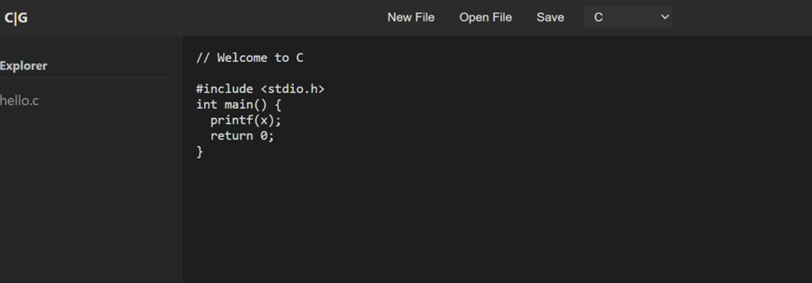
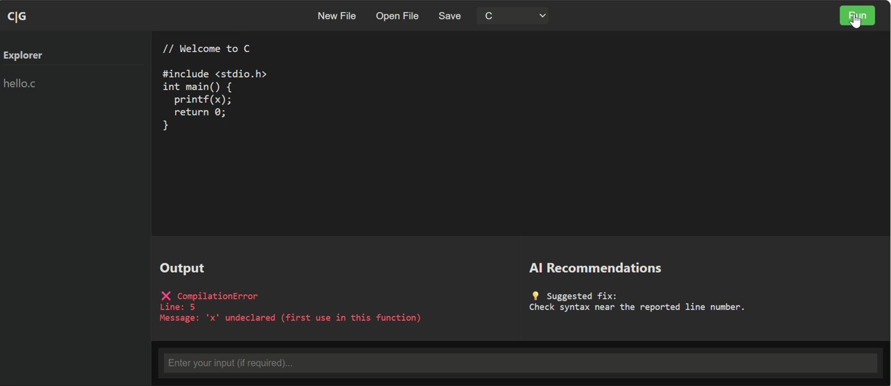
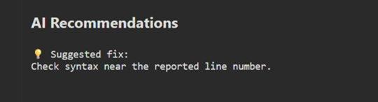
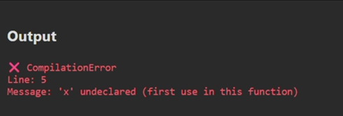

# Code_Guardian "AI-Powered Online Compiler & Debugging Engine"

An intelligent multi-language online compiler that not only executes code but also analyzes errors using AI to provide **line-level feedback and detailed explanations**.
---
## Problem Statement

Traditional online compilers only display raw errors, which are often difficult for beginners to understand.

This project solves that by integrating **AI-based error analysis**, helping users:

* Identify the exact line where the error occurred
* Understand the type of error
* Get human-readable explanations

---

## Features
*  Multi-language support (Python, C, C++, Java)
*  AI-powered error detection
*  Line-by-line error identification
*  Human-readable error explanations
*  Fast code execution engine
*  Beginner-friendly debugging support

---
##  Architecture

User Code
→ Execution Engine (Language Runner)
→ Error Output
→ AI Analyzer
→ Structured Feedback (Line + Error Type + Explanation)

---

##  Tech Stack

* Python (Core Backend)
* Subprocess / Runtime Execution
* Basic HTML Frontend
* AI/NLP for error analysis

---

##  Project Structure

main.py            → Main backend controller
python_runner.py   → Python execution
c_runner.py        → C execution
cpp_runner.py      → C++ execution
java_runner.py     → Java execution
home.html          → User interface

---

##  Security Note

This project uses basic execution handling. For production-grade systems, sandboxing (e.g., Docker) and resource limits are recommended.

---

##  Future Improvements

* Docker-based sandboxing
* Advanced AI debugging (suggest fixes)
* Web-based IDE interface
* API for external integration

---

##  Use Cases

* Online coding platforms
* AI-based learning tools
* Beginner-friendly compilers
* Coding education systems

---

##  Topics

ai code-execution debugging compiler python backend nlp error-detection system-design

---

## Example

Input Code:
print("Hello"

AI Output:
Line 1: SyntaxError  
Missing closing parenthesis ')'  
Fix: Add ')' at the end of the print statement

---

##  Demo

###  Code Input

###  Running Code

###  AI Error Detection

###  Output

---
